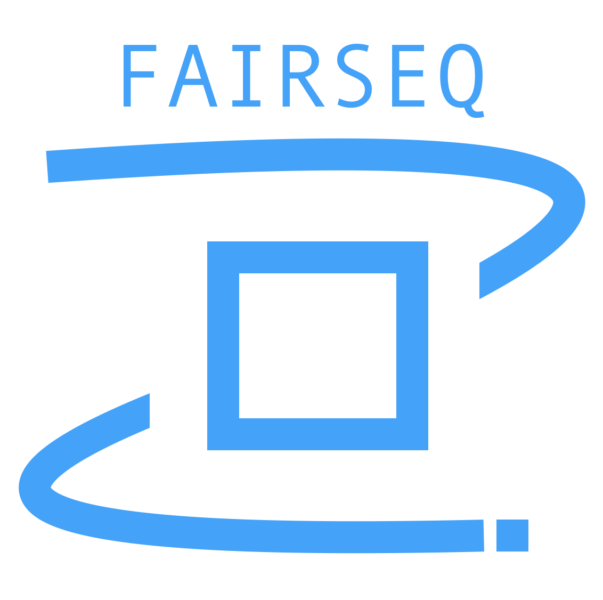

<p align="center">
  
  <br />
  <br />
  <a href="https://github.com/pytorch/fairseq/blob/master/LICENSE"></a>
  <a href="https://github.com/pytorch/fairseq/releases"></a>
  <a href="https://github.com/pytorch/fairseq/actions?query=workflow:build"></a>
  <a href="https://fairseq.readthedocs.io/en/latest/?badge=latest"></a>
</p>

--------------------------------------------------------------------------------
# Better Sign Language Translation with Large-Scale Monolingual Data

## Cite

[Mono-SLT paper]():

```
@article{peng2022better,
  title={Better Sign Language Translation with Monolingual Data},
  author={Ru Peng and Yawen Zeng and Junbo Zhao},
  journal={arXiv preprint arXiv:xxx},
  year={2023}
}
```
